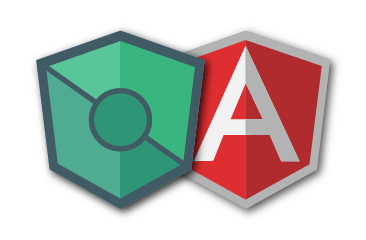

# Introduction

If you heard about Flux, Redux, MobX \(used for React apps\) NgRx and  NGXS \(used for the latest version of Angular\), those are state management pattern or library that acts as single source of truth for web application's state. AngularJS Store was based on those popular libraries.

AngularJS Store is specially designed for AngularJS application. It will guide you to create a one way data flow in your application \(Single Source of Truth\). Help you manage your AngularJS application's state into a very predictable way.

### New to AngularJS Store?

 If you're just getting started with AngularJS Store, I recommend you head over to the [tutorials](tutorials/) and also checkout the [API reference](api-reference/) for more detailed information.

